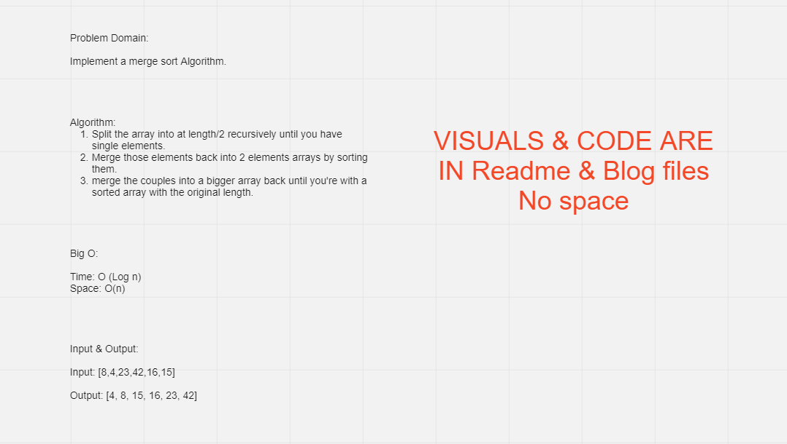

# Challenge Summary
<!-- Description of the challenge -->

Implement a Merge sort algorithm.

Blog: [Link](./Blog.md)

## Whiteboard Process
<!-- Embedded whiteboard image -->




## Approach & Efficiency
<!-- What approach did you take? Why? What is the Big O space/time for this approach? -->

Time complexity: Ο(n log n).
Space Complexity: O(n).


## Solution
<!-- Show how to run your code, and examples of it in action -->

```
public static int[] MergeSort(int[] arr)
        {
            int n = arr.Length;

            if (n > 1)
            {
                int mid = n / 2;
                int[] left = arr[0..mid];
                int[] right = arr[mid..n];

                MergeSort(left);

                MergeSort(right);

                Merge(left, right, arr);

            }

            return arr;
        }

        public static int[] Merge(int[] left, int[] right, int[] arr)
        {
            int i = 0;
            int j = 0;
            int k = 0;


            while (i < left.Length && j < right.Length)
            {
                if (left[i] <= right[j])
                {
                    arr[k] = left[i];
                    i = i + 1;
                }
                else
                {
                    arr[k] = right[j];
                    j = j + 1;
                }

                k = k + 1;
            }

            if (i == left.Length)
            {
                Array.Copy(right, j, arr, k, right.Length - j);
            }
            else
            {
                Array.Copy(left, i, arr, k, left.Length - i);
            }

            return arr;
        }
        ```