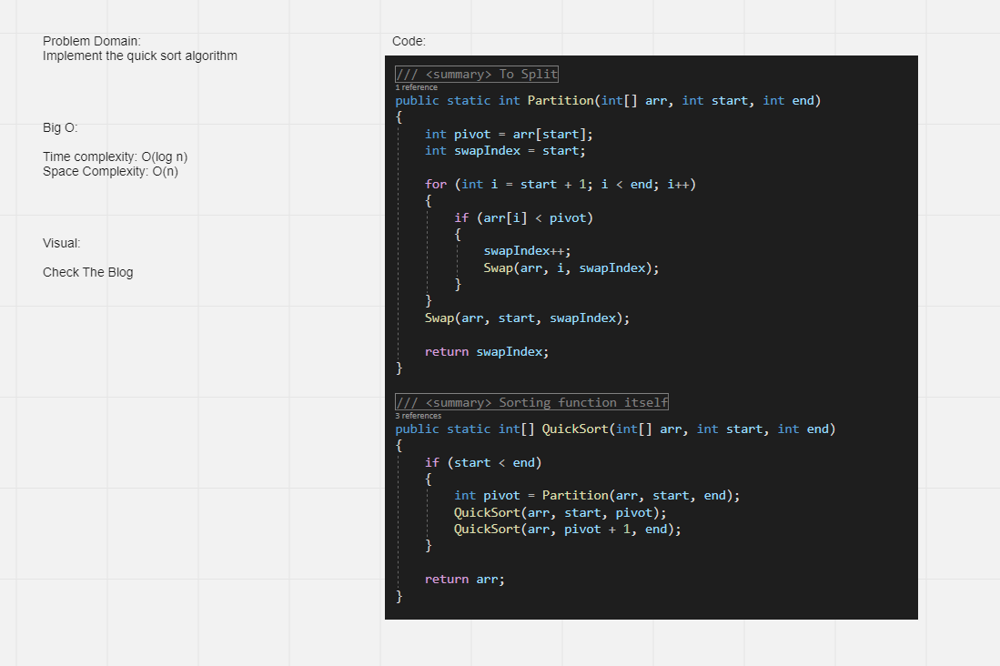

# Challenge Summary
<!-- Description of the challenge -->
Implementing Quick Sort Algorithm

## Whiteboard Process
<!-- Embedded whiteboard image -->

## Approach & Efficiency
<!-- What approach did you take? Why? What is the Big O space/time for this approach? -->

Time: O(log n)
Space: O(n)

## Solution
<!-- Show how to run your code, and examples of it in action -->

[Code](./quick-sort)
