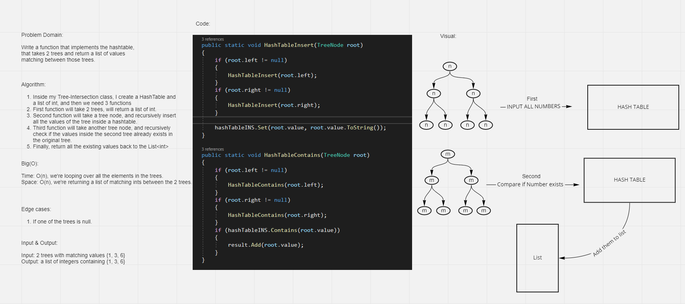

# Challenge Summary
<!-- Description of the challenge -->

Write a function that takes in 2 trees & returns a list of common values between them.

## Whiteboard Process
<!-- Embedded whiteboard image -->

## Approach & Efficiency
<!-- What approach did you take? Why? What is the Big O space/time for this approach? -->

Time: O(n) because we loop over n elements in trees.
Space: O(n) because we return a list of n elements from trees.

## Solution
<!-- Show how to run your code, and examples of it in action -->

[Link](./tree-intersection)
