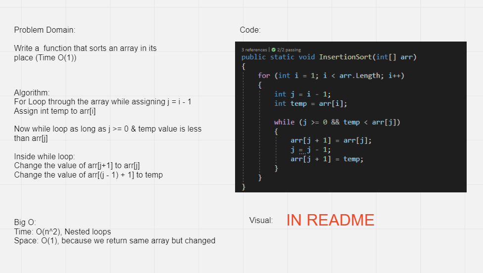

# Challenge Summary
<!-- Description of the challenge -->
Write a function that takes an array and sort it directly without returning a new array.

## Whiteboard Process
<!-- Embedded whiteboard image -->

## Full steps (Blog)
<!-- Embedded Steps image -->
[Link](./steps.md)

## Approach & Efficiency
<!-- What approach did you take? Why? What is the Big O space/time for this approach? -->
Time: O(n) : Nested loops.  
Space: O(1) : Returning the same array.

## Solution
<!-- Show how to run your code, and examples of it in action -->
[Link](./code)