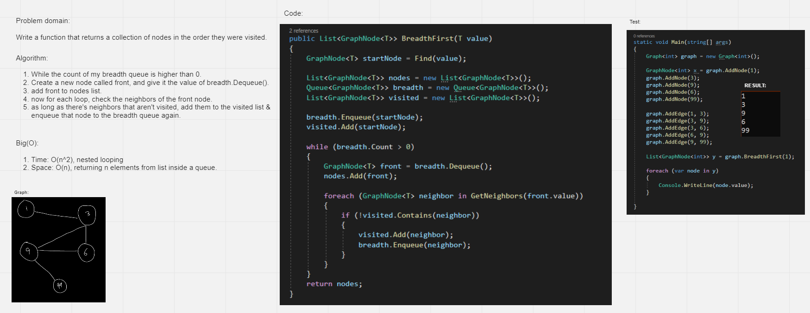

# Challenge Summary
<!-- Description of the challenge -->

Write a function that returns a collection of nodes in the order they were visited

## Whiteboard Process
<!-- Embedded whiteboard image -->

## Approach & Efficiency
<!-- What approach did you take? Why? What is the Big O space/time for this approach? -->

Time: O(n^2), looping twice
Space: O(n), returning n elements from list

## Solution
<!-- Show how to run your code, and examples of it in action -->

[Link](./Graph)