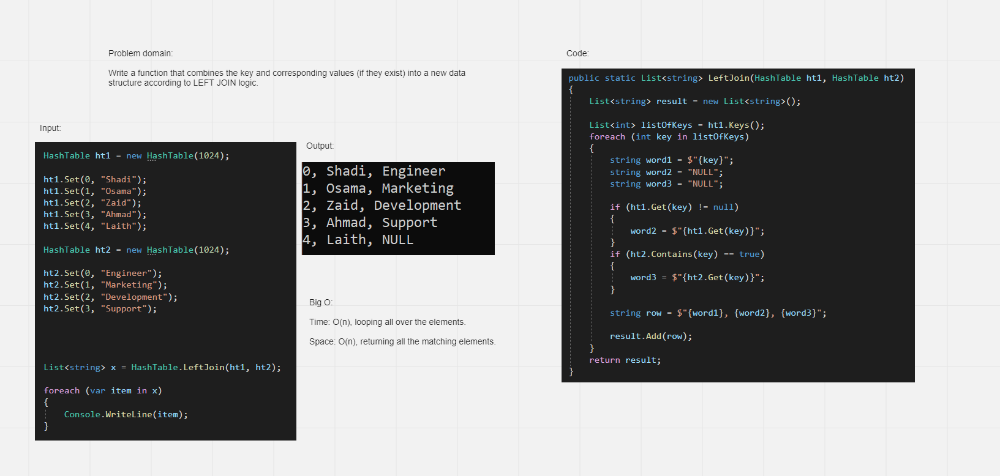

# Hashmap LEFT JOIN
<!-- Short summary or background information -->

Write a function that combines the key and corresponding values (if they exist) into a new data structure according to LEFT JOIN logic.

 
 
## Whiteboard

 
 
## Approach & Efficiency
<!-- What approach did you take? Why? What is the Big O space/time for this approach? -->

BigO:  
Time: O(n), we loop over the elements.
Space: O(n), we return n elements in a new list.

 
 
## Solution
<!-- Embedded whiteboard image -->

[Link](./hash-table)